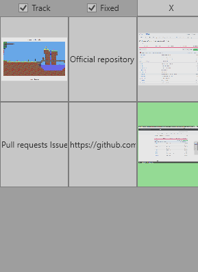

# QuickHelper

My program-assistant that is used to solve small problems.

## Brief description

Program helps with storing additional data. It provides 9 temporary buffers which can keep texts or images. Program tracks Windows Clipboard and copies all supported data (if appropriate checkbox is set). You can delete any buffer with click on right mouse button. If you click on button binded to it data will be copied into Clipboard.

## Screenshots

| Simple work case                                                   |
|--------------------------------------------------------------------|
|           |

## Compiling

This project needs C# 7.0 and WPF.

## License information

This project is licensed under the terms of the [Apache License 2.0](LICENSE).
